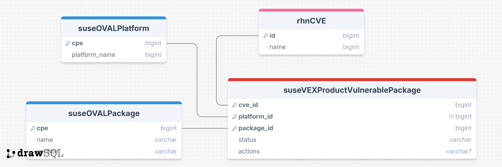

- Feature Name: CVE auditing with VEX
- Start Date: 2025-02-19

# Summary
[summary]: #summary

Use VEX in addition to existing implementation to increment CVE auditing accuracy. 

# Motivation
[motivation]: #motivation

In a world constantly endangered by security flaws it is crucial to detect threats in order to secure our systems. However detection systems may detect false positives from products that use vulnerable libraries but do not use vulnerable functions. Or even not detecting produts whose vulnerabilities are not patched yet.

Due to this, many companies like Red Hat are adopting **VEX** (*Vulnerability Exploitability eXchange*) [^1], a profile in the Common Security Advisory Framework. VEX allows to clasify CVEs affecting a product by CPE and components by PURLs. At the same time, consolidates duplicated entries and offers detailed statuses for the vulns. Making VEX a more efficient, precise and up-to-date system for vulnerability reporting.

The aim is to polish CVE auditing, simplifying administration and keeping Uyuni up to date with the market standards. This way, when performing a CVE audit, VEX data will be used, falling back to OVAL or legacy channels if VEX data was not available.

# Detailed design
[design]: #detailed-design

The implementation for VEX will follow a similar structure as existing OVAL one [^2]. Here is a diagram to ilustrate the modules structure:

TODO - Create diagram

Mainly we will have two main objectives: **VEX data storaging/processing** and **CVE analysis**.

## VEX Data Storage and Processing

### VEX Downloader

Retrieve VEX documents online. Is responsible finding, downloading and caching the files, like was done for OVAL [^2].

Each supported distribution has a repository with VEX files (usually on *JSON* or *CSAF* format) where the module will download the data from. However, URLs will not be hardcoded, enabling any user to change the default source. For example in case of using a proxy.

#### Synchronization

To ensure accuracy is crucial to keep VEX data up-to-date, so data have to be synchronized periodically. The time ammount needed for performing this opperation will deppend on how many operating systems are being used. For instance, in case the user uses a single OS it will take just a few second, which differs with the case of using 20 different OOSS.

Anyway syncronizing VEX data **once a day** on low workload hours may be a good default, but it will be possible for the user to change it.

In certain cases, downloading all data can be redundant as it did not change since last sync. For that reason, many repositories include a manifest file that contains hashes for VEX files. Comparing those hashes with local files before downloadings will improve efficiency. For those cases when there is no manifest file, it is possible to perform a html scrapping to decide if data should be downloaded.

### VEX Parser

VEX file are usually on JSON or CSAF format so is needed to translate them into POJO format in order to use its data. Despite the files come from trusted sources, they will be validated to ensure they contain correct and non-malicious data.

### VEX DAO

It provides an interface to work with the VEX data. Is the only way to query or modify the information from the database. Since VEX introduces new fields that aren’t part of OVAL a new DAO module specific for VEX will be included. This keeps the new logic isolated in case of full migration to VEX.

### DB Storage

As said, VEX data contains additional fields (like *analysis status*, *justification*, and *recommended response*) so new tables are needed to store and query this extra metadata. It was taken into consideration the idea of reusing OVAL-related tables, however it brings the following drawbacks:

- Since VEX and OVAL have a **different fields**, keeping both types of info in the same tables will enforce the addition of an *data_type* attribute to distinguish each entry. This leads to **unasigned attributes** for each entry.
- Keeping isolated VEX and OVAL data eases an hypothetical full migration to VEX.

#### DB Schema

##### Existing tables

As said, OVAL-specific tables will be kept appart. However, there are some existing tables that will be reused as they hold information:

- `rhnCVE`: Contains detected CVEs.

- `rhnPackageName`: Contains package names for managed packages.

- `rhnPackageEVR`: Contains package versions (EVRs).

##### New tables

To hold VEX data there are some tables required:

- `suseVEXAnnotations`: Maintains CVE's VEX fields like the affectedness status or the justification.

- `suseVEXProduct`: This table keeps products info like CPEs and names. It is worth studying if `suseovalplatform` could be reused to hold product data.

- `suseVEXProductAnnotation`: Relates each product with the CVEs affecting it.

##### Diagram

## CVE enhanced analysis

TODO

## API Access

TODO

# Drawbacks
[drawbacks]: #drawbacks

Why should we **not** do this?

  * will it impact performance?

# Alternatives
[alternatives]: #alternatives

# Unresolved questions
[unresolved]: #unresolved-questions

- Is it possible to reuse `suseovalplatform` table for VEX product descriptions? [^2]
- Should be taken into consideration data from the legacy system (OVAL) if VEX is available?

# References
[references]: #references

[^1]: [The Future of Red Hat Security Data](https://www.redhat.com/en/blog/future-red-hat-security-data)
[^2]: [CVE Auditing with OVAL](https://urldefense.com/v3/__https://github.com/uyuni-project/uyuni-rfc/pull/80__;!!D9dNQwwGXtA!X5VPAqQnoak6vx4dsUErkpGohMhPg4gLYeBXbT5Ith8UQwCd2TNWkXtTAG786GipiVEsxTxTc3W2xmM$)
[^3]: [VEX use cases](https://www.cisa.gov/sites/default/files/publications/VEX_Use_Cases_Aprill2022.pdf)
[^4]: [Database schema](https://drawsql.app/teams/caliphal/diagrams/vex-database-schema)